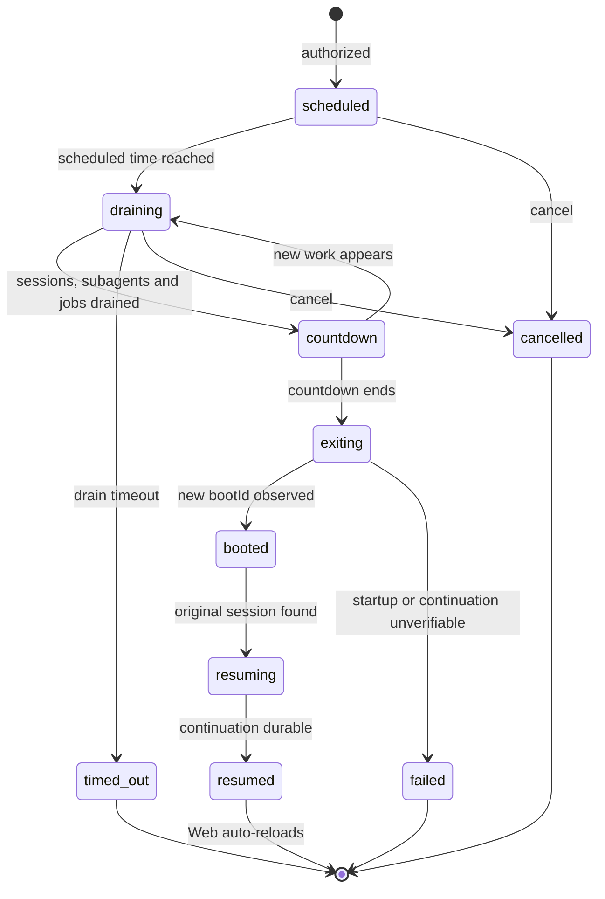

# dsh-restart-resume

[简体中文](README.md) | English


Safe, drain-aware restart and same-session continuation for DeepSeek Harness rc8: report truthful state, let an external supervisor relaunch the backend, and restore the Web page only after continuation is durable.

> **Required:** DSH must be launched by a supervisor that understands exit code 75. The plugin cannot relaunch an exited process by itself; `dsh_restart` refuses to proceed without a supervisor.

## 30-second quick start

Requirements: Node.js 22.19+ and DeepSeek Harness 0.1.0-rc.8+.

Download the archive from Releases and install it into the Web profile:

```powershell
dsh plugin --profile web add .\dsh-restart-resume-0.2.2.tgz
```

Configure a launcher using the [supervisor contract and example](docs/SUPERVISOR.md), then start DSH through that supervisor. A plain `dsh web` process cannot be relaunched automatically.

First validation prompt:

> Check the restart status. Only when the supervisor, bootId, and runtime version are verifiable, schedule one report-only test restart. Do not ask me to refresh the page manually.

## What users observe

- A restart waits for active sessions, subagents, and background jobs instead of force-killing them.
- The final countdown appears only after drain; new work moves the state back to draining.
- While the backend is unreachable, the banner says startup is unobservable instead of claiming success.
- A new `bootId` proves that a new backend process answered.
- The Web client reconnects and reloads after the original session's continuation is durable.
- “Cancel restart” briefly confirms the terminal state and then removes the banner completely.
- Startup or continuation failures remain failures and are never presented as completed restarts.

## Three stable tools

| Tool | Purpose | Writes |
| --- | --- | --- |
| `dsh_restart` | Schedule a supervised restart and, by default, continue the larger task in the same session | Yes: persists a marker and ultimately requests exit |
| `dsh_restart_status` | Read phase, countdown, blockers, bootId, and the stable tool-surface digest | No |
| `dsh_restart_cancel` | Cancel a pending restart and clean up its marker | Yes: cancels the marker |

All three tools keep the same order and schemas; restart state does not alter the model-request tool prefix.

## State flow



## Safety behavior

- The default drain covers active sessions, published subagents, and background jobs.
- Drain timeout cancels without force-killing work; a tool call must allow at least five minutes.
- The final countdown defaults to 10 seconds and cannot be shorter than 5.
- Only exit code 75 requests relaunch; normal exits and crashes must not loop.
- Atomic markers, TTL, rate limits, and idempotent messages prevent duplicate continuation and restart loops.
- `resumeMode: "continue"` resumes unfinished configuration, verification, and delivery. Use `report-only` only for an isolated test.
- The continuation contract says Web recovery is automatic. An agent should recommend manual refresh only after a concrete check proves the page is stale.

## Supervisor contract

Before each process launch, the launcher must set:

```text
DSH_RESTART_SUPERVISOR=1
DSH_BOOT_ID=<a new identifier for every process>
DSH_RUNTIME_VERSION=<the DSH version actually verified by the launcher>
```

It must relaunch only on exit code 75 and cap restarts within a time window. See [docs/SUPERVISOR.md](docs/SUPERVISOR.md) for a PowerShell example, exit semantics, and acceptance checklist.

## Configuration

| Setting | Default | Range / purpose |
| --- | --- | --- |
| `defaultDelaySeconds` | 10 | 5–3600, delay before drain eligibility |
| `drainTimeoutSeconds` | 1800 | 300–86400, maximum drain wait |
| `finalCountdownSeconds` | 10 | 5–300, truthful final countdown |
| `pollIntervalMs` | 250 | 100–2000, state polling interval |
| `maxRestarts` / `restartWindowSeconds` | See patch | Restart rate limit |
| `resumeTtlSeconds` | 86400 | Pending continuation marker lifetime |
| `resumePrompt` | Built-in safety text | Fixed message appended to the original session |

A single `dsh_restart` call may set `delaySeconds`, `maxWaitSeconds`, `resumeMode`, and `afterRestart`, but cannot bypass safety minimums.

## Context and cache design

The plugin injects no system prompt. Dynamic state appears only in explicit tool results, and the Web banner stays in the browser presentation layer. Serialize each tool's `name`, `description`, and `parameters` and compare SHA-256 before and after an upgrade; the digest should remain stable for the same version and configuration.

## Troubleshooting

| Symptom | Cause and action |
| --- | --- |
| `restart supervisor is not active` | The process was not launched by a compliant supervisor; restart it using the supervisor guide |
| Invalid or unchanged `DSH_BOOT_ID` | The supervisor did not generate a new identifier per process; fix it before retrying |
| Banner remains after cancellation | Confirm cancellation with `dsh_restart_status`; if terminal state remains beyond the brief acknowledgement period, report browser logs |
| Startup stays “unobservable” | The backend is down, the status API is unreachable, or bootId did not change; inspect supervisor output and do not count this as success |
| Backend returns without continuation | Check marker expiry, original-session availability, and backend logs; failure is not rewritten as success |
| Page does not auto-refresh | First verify that state reached `resumed`; manually refresh only if the current page is demonstrably stale, then report the reproduction |
| Restart loop | The supervisor must handle only exit code 75 and enforce a rate limit alongside the plugin |

## Relationship to other lifecycle tools

- User `cordis.patch.yml`: transactional HMR for an already resolvable package; editing a patch does not install dependencies.
- [dsh-super-injector](https://github.com/yjh051108/dsh-super-injector): development-time hot injection, reload, and unload.
- This plugin: supervised full-process restart when backend or client bundles must reload.

The mechanisms are independent and complementary. This plugin does not impersonate, bundle, invoke, or depend on super-injector.

## Development verification

```powershell
npm test
npm pack --dry-run
```

CI runs the same checks on Windows with Node.js 22.19. Include DSH/Node versions, supervisor output, redacted status results, and a minimal reproduction when reporting a problem.

## Support and community

Report plugin-specific problems in this repository's [Issues](https://github.com/Asteroid0449/dsh-restart-resume/issues). Send confirmed Harness-level problems to [DeepSeek Harness Discussions](https://github.com/deepseek-ai/deepseek-harness/discussions). Read the [contributing guide](https://github.com/Asteroid0449/dsh-restart-resume/blob/main/CONTRIBUTING.md) before contributing and the [security policy](https://github.com/Asteroid0449/dsh-restart-resume/blob/main/SECURITY.md) for security reports.

## Acknowledgements and project status

This is an independently maintained community plugin for DeepSeek Harness. It is not an official DeepSeek product and is not sponsored, endorsed, or certified by DeepSeek. We thank the [DeepSeek Harness](https://github.com/deepseek-ai/deepseek-harness) team for the plugin platform, bundle mechanism, and development documentation.

Thanks to [dsh-super-injector](https://github.com/yjh051108/dsh-super-injector) for its exploration of development-time hot injection, reload, and unload workflows in DSH. dsh-super-injector serves the development plugin lifecycle, while this plugin handles supervised backend process restarts and same-session continuation. The two are independent and complementary; this plugin does not bundle, invoke, or depend on dsh-super-injector.

The names and trademarks of DeepSeek Harness, DeepSeek, and other third-party projects remain the property of their respective owners. They are referenced here solely to identify compatibility and project relationships.

## License

[MIT](LICENSE)
