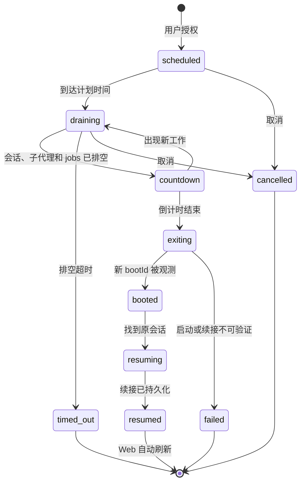

# dsh-restart-resume

简体中文 | [English](README.en.md)


面向 DeepSeek Harness rc8 的安全自重启与同会话续接：等待工作排空、展示真实状态、由外部监督器重新拉起后端，并在续接落盘后自动恢复 Web 页面。

> **必要前提：** DSH 必须由理解退出码 75 的监督器启动。插件不能凭空重新拉起已经退出的进程；没有监督器时，`dsh_restart` 会拒绝执行。

## 30 秒快速开始

要求：Node.js 22.19+、DeepSeek Harness 0.1.0-rc.8+。

从 Releases 下载压缩包后安装到 Web profile：

```powershell
dsh plugin --profile web add .\dsh-restart-resume-0.2.2.tgz
```

随后按 [监督器契约与示例](docs/SUPERVISOR.md) 配置启动器，并通过监督器重新启动 DSH。普通的 `dsh web` 不满足自动拉起条件。

首次验证可以告诉 Agent：

> 查询自重启状态。只有监督器、bootId 和运行版本都可验证时，安排一次 report-only 测试重启；不要要求我手动刷新页面。

## 普通用户会看到什么

- 重启请求先进入等待排空状态，不会强杀会话、子代理或后台任务。
- 最终倒计时只在已经排空时出现；期间出现新工作会退回等待状态。
- 后端断联期间状态条明确显示“启动暂不可观测”，不会提前宣称成功。
- 新 `bootId` 证明新的后端实例已经应答。
- 原会话的续接消息持久化后，Web 自动重连并刷新。
- 点击“取消重启”后，终止状态会短暂确认并彻底移除，不持续闪烁。
- 启动或续接失败会显示失败状态，不会伪装成“重启完成”。

## 三项固定工具

| 工具 | 用途 | 是否写入 |
| --- | --- | --- |
| `dsh_restart` | 安排受监督重启，默认把它视为原任务中的检查点并在同会话继续 | 是：写入持久化 marker，并最终请求退出 |
| `dsh_restart_status` | 查询阶段、倒计时、阻塞项、bootId 和稳定工具面摘要 | 否 |
| `dsh_restart_cancel` | 取消尚未退出的重启请求并清理状态 | 是：取消 marker |

三个工具始终以相同顺序和 schema 注册；状态变化不会改变模型请求的工具前缀。

## 状态流程



## 安全行为

- 默认等待全部活跃会话、已发布子代理和后台 jobs 排空。
- 排空超时只取消重启，不强杀工作；单次工具调用最短等待 5 分钟。
- 最终倒计时默认 10 秒、最短 5 秒。
- 只用退出码 75 请求自动拉起；普通退出和崩溃不能形成重启循环。
- 原子 marker、有效期、频率限制和幂等消息避免重复续接与重启环路。
- `resumeMode: "continue"` 会继续原始任务中尚未完成的配置、验证和交付；只有独立测试才使用 `report-only`。
- 续接契约明确规定 Web 自动恢复。只有实际检查证明页面仍旧时，Agent 才应建议手动刷新。

## 监督器契约

启动器必须在每次拉起进程前设置：

```text
DSH_RESTART_SUPERVISOR=1
DSH_BOOT_ID=<每次启动生成的新标识>
DSH_RUNTIME_VERSION=<启动器实际校验过的 DSH 版本>
```

它必须只在退出码 75 时重新拉起，并限制短时间内的重启次数。完整的 PowerShell 示例、退出语义和验收清单位于 [docs/SUPERVISOR.md](docs/SUPERVISOR.md)。

## 配置

| 配置项 | 默认值 | 范围/作用 |
| --- | --- | --- |
| `defaultDelaySeconds` | 10 | 5–3600，进入排空前的计划延迟 |
| `drainTimeoutSeconds` | 1800 | 300–86400，等待工作排空的上限 |
| `finalCountdownSeconds` | 10 | 5–300，退出前的最终倒计时 |
| `pollIntervalMs` | 250 | 100–2000，状态检查间隔 |
| `maxRestarts` / `restartWindowSeconds` | 见 patch | 重启频率上限 |
| `resumeTtlSeconds` | 86400 | 待续接 marker 有效期 |
| `resumePrompt` | 内置安全提示 | 追加到原会话的固定续接文本 |

单次 `dsh_restart` 可设置 `delaySeconds`、`maxWaitSeconds`、`resumeMode` 和 `afterRestart`，但不能突破安全下限。

## 上下文与缓存

插件不注入 system prompt。动态重启状态只在显式工具结果中出现，Web 状态条完全位于浏览器展示层，不进入模型上下文。升级前后可序列化三项工具的 `name`、`description` 和 `parameters` 并比较 SHA-256；相同版本和配置下应保持一致。

## 常见问题

| 现象 | 原因与处理 |
| --- | --- |
| `restart supervisor is not active` | 当前进程不是由合规监督器启动；按监督器文档重新启动 |
| `DSH_BOOT_ID` 无效或没有变化 | 监督器没有为每次进程生成新标识；修复后再测试 |
| 取消后状态条仍出现 | 先调用 `dsh_restart_status` 确认已取消；若终止状态超过短暂确认期仍存在，请提交浏览器日志 |
| 状态长期“不可观测” | 后端尚未恢复、状态 API 不可达或 bootId 没变化；检查监督器终端，不要把它当作成功 |
| 后端恢复但没有续接 | 检查 marker 是否过期、原会话是否存在以及后端日志；失败不会自动改报成功 |
| 页面没有自动刷新 | 先验证已经到达 `resumed`；只有页面确实仍加载旧状态时才手动刷新并提交复现 |
| 反复重启 | 监督器应只处理退出码 75，并同时启用插件与监督器的频率限制 |

## 与其他生命周期工具的关系

- 用户 `cordis.patch.yml`：已能从 profile 解析的包可事务化 HMR，写 patch 本身不会安装依赖。
- [dsh-super-injector](https://github.com/yjh051108/dsh-super-injector)：开发态热注入、重载与卸载。
- 本插件：必须重新加载后端或前端 bundle 时，走受监督的正式进程重启。

三者相互独立、定位互补，本插件不冒充、包含、调用或依赖 super-injector。

## 开发验证

```powershell
npm test
npm pack --dry-run
```

CI 在 Windows + Node.js 22.19 上执行同样检查。报告问题时请附 DSH/Node 版本、监督器输出、已脱敏的状态结果和最小复现步骤。

## 反馈与社区

插件问题请提交到本仓库 [Issues](https://github.com/Asteroid0449/dsh-restart-resume/issues)。确认属于 Harness 上游的问题，再前往 [DeepSeek Harness Discussions](https://github.com/deepseek-ai/deepseek-harness/discussions)。贡献前请阅读 [贡献指南](https://github.com/Asteroid0449/dsh-restart-resume/blob/main/CONTRIBUTING.md)，安全问题请阅读 [安全策略](https://github.com/Asteroid0449/dsh-restart-resume/blob/main/SECURITY.md)。

## 致谢与项目状态

本项目是独立维护的 DeepSeek Harness 社区插件，并非 DeepSeek 官方产品，也未获得 DeepSeek 的背书、合作或认证。感谢 [DeepSeek Harness](https://github.com/deepseek-ai/deepseek-harness) 团队提供插件平台、bundle 机制与开发文档。

感谢 [dsh-super-injector](https://github.com/yjh051108/dsh-super-injector) 项目对 DSH 开发态热注入、重载与卸载流程的探索。dsh-super-injector 面向开发态插件生命周期，本插件面向受监督的后端进程重启和同会话续接；两者相互独立、定位互补。本插件不包含、调用或依赖 dsh-super-injector 的实现。

DeepSeek Harness、DeepSeek 及其他第三方项目的名称与商标归各自权利人所有；本文提及这些名称仅用于说明兼容性和项目关系。

## 许可证

[MIT](LICENSE)
